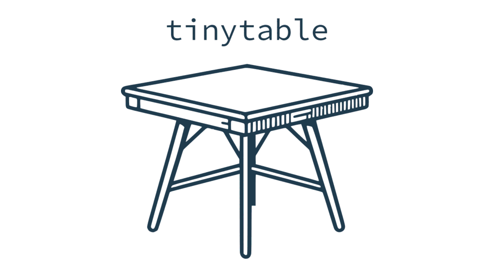

<p align="center">

<br> <!-- badges: start -->
<a href = "https://github.com/vincentarelbundock/tinytable/blob/main/LICENSE.md" target = "_blank"></a>
<a href = "https://vincentarelbundock.github.io/tinytable/" target = "_blank"></a>
<a href = "https://cran.r-project.org/package=tinytable" target = "_blank"></a>
<!-- badges: end -->
</p>

## What?

`tinytable` is a small but powerful `R` package to draw beautiful tables
in a variety of formats: HTML, LaTeX, Word, PDF, PNG, Markdown, and
Typst. The user interface is minimalist and easy to learn, while giving
users access to powerful frameworks to create endlessly customizable
tables.

<https://vincentarelbundock.github.io/tinytable/>

## Why?

There are already many excellent table-drawing packages in the `R`
ecosystem. Why release a new one? As [the maintainer of
`modelsummary`](https://modelsummary.com), I needed a table-drawing
package which was:

-   *Simple*: Streamlined, consistent, and uncluttered user interface,
    with few functions to learn.
-   *Flexible*: Expressive frameworks to customize tables in HTML and
    LaTeX formats.[1]
-   *Zero-dependency*: Avoid importing any other `R` package.[2]
-   *Concise*: Draw beautiful tables without typing a lot of code.
-   *Safe*: User inputs are checked thoroughly, and informative errors
    are returned early.
-   *Maintainable*: A small code base which does not rely on too many
    complex regular expressions.
-   *Readable*: HTML and LaTeX code should be human-readable and
    editable.
-   *Free*: This package will always be free. Tiny tables for a tiny
    price!

To achieve these goals, the design philosophy of `tinytable` rests on
three pillars:

1.  *Data is separate from style.* The code that this package creates
    keeps the content of a table separate from the style sheet that
    applies to its cells. This is in contrast to other `R` packages that
    modify the actual text in each cell to style it. Keeping data and
    style separate allows `tinytable` to create human-readable files
    which are easy to edit, debug, and extend. It also enables
    developers to keep a simpler code base, with minimal use of messy
    regular expressions.

2.  *Flexibility.* Users’ needs are extremely varied, and a
    table-drawing package must be flexible enough to accomodate
    different ideas. To achieve this, `tinytable` builds on
    battle-tested and versatile frameworks like `Bootstrap` for HTML and
    `tabularray` for LaTeX.

3.  [*Lightweight is the right weight.*](https://www.tinyverse.org/)
    Some of the most popular table-drawing packages in the `R` ecosystem
    are very heavy: A single `library()` call can sometimes load upwards
    of 65 `R` packages. In contrast, `tinytable` imports zero 3rd party
    `R` package by default.

## Installation

Install the stable version from CRAN:

``` r
install.packages("tinytable")
```

`tinytable` is a relatively new package with rapid development. If you
want to benefit from the latest features—showcased on the package
website—you may want to install the development version from Github.

``` r
library(remotes)
install_github("vincentarelbundock/tinytable")
```

Restart `R` completely for the installation to take effect.

## Get started

-   [Tutorial
    (HTML)](https://vincentarelbundock.github.io/tinytable/vignettes/tutorial.html)
-   [Tutorial
    (PDF)](https://vincentarelbundock.github.io/tinytable/vignettes/tutorial.pdf)

## Alternative packages

Several people have asked me how `tinytable` compares to alternative
table-drawing packages in `R`. And indeed, there are many fantastic
table-drawing packages already out there. Most of theses alternatives
have features that `tinytable` does not (yet) support. If you don’t find
what you need in `tinytable`, I recommend you try one of these:

-   [`gt`](https://gt.rstudio.com)
-   [`kableExtra`](https://haozhu233.github.io/kableExtra/)
-   [`huxtable`](https://hughjonesd.github.io/huxtable/)
-   [`DT`](https://rstudio.github.io/DT/)
-   [`flextable`](https://davidgohel.github.io/flextable/)

Here are a few totally biased (and possibly unfair) comments about each
of them.

The first difference between `tinytable` and alternatives is that
`tinytable` covers much of the same functionality without loading any
other `R` package by default. I think it is very important for `R`
package developers to have access to a table-drawing package that does
not force them to import half of the `tidyverse`. In my view, this
service to developers alone justifies writing a new package.

Now let’s consider alternatives one by one.

`gt` (63 dependencies) is an amazingly powerful table-drawing package;
possibly the most powerful in R. I like it *a lot*, and it is the one I
recommend if you don’t find the features you need in `tinytable`. The
reasons I don’t personally use `gt` on a day-to-day basis are entirely
subjective. First, and least important, I find its syntax very verbose:
customizing any aspect of a table always seems to take *many*
keystrokes. Second, and this is obviously a reflection of my own
limitations, but I have never quite figured out how `gt` actually works;
it has so many exported functions (180+!) that I get lost. `gt` is more
powerful than `tinytable`, but that power comes at the price of
complexity. One goal of `tinytable` is to let you do 98% of what you
need by learning 4 simple functions; then you can use a bit of CSS or
LaTeX if you need extreme customization.

`kableExtra` (49 dependencies) is a very flexible package [with amazing
documentation.](http://haozhu233.github.io/kableExtra/) Before writing
`tinytable`, I actually made a few [very minor contributions and bug
fixes](https://github.com/haozhu233/kableExtra/graphs/contributors) to
`kableExtra`. In the end, however, I concluded that while the package is
great, its code base is too hard to maintain and extend. The challenge
on the backend is that `kableExtra` accepts tables drawn as raw strings
by the `knitr` package, and then modifies them using a series of complex
regular expressions. The author has done truly amazing work, but it’s
just a really difficult strategy to implement, scale, and maintain.
(Incidentally, `kableExtra` is not very actively developed anymore.)
Finally, I really like the concept of separating styling from data, and
`kableExtra` modifies the content of every cell to style its content.
That sometimes makes LaTeX and HTML code pretty hard to read and edit.

`huxtable` (29 dependencies) is an interesting and powerful-looking
package, but I know it less well than the others. The key design
decision of the author is that each feature is implemented with a
distinct function. I understand that design impulse: going through the
documentation of a function with 50 arguments can be daunting. That
said, I feel that sifting through a manual with 300+ exported functions
also makes for a steep learning curve. In addition, I prefer HTML and
LaTeX code to be human-readable, in case I need to tweak them by hand
before publication; `huxtable` tables are not that.

`DT` (40 dependencies) is nice, but it only draws HTML table, so that’s
a non-starter for me. I need HTML, LaTeX, Word, PNG, PDF, and Typst
output, depending on the project I am working on.

`flextable` (40 dependencies) is nice, but it does not support LaTeX,
and I need that format for “real work.”

At this point, it’s useful to point out that there are also many
packages to compute statistics and build tables (ex: `modelsummary`,
`gtsummary`, `table1`). Many of those packages delegate the actual
drawing of the tables (ie: lines and colors) to one of the table-drawing
packages listed above. In that sense, `tinytable` should be seen as more
of a complement than an alternative to data summary packages. The goal
of `tinytable` is to help users and developers convert data frames into
beautiful tables easily. What people put in those tables is outside the
scope of `tinytable`. If you are interested in a package to create data
summaries and regression tables/plots, please check out my
`modelsummary` package: <https://modelsummary.com>

Did I miss your favorite package? Drop me a note and I’ll add it to the
list.

[1] Other formats like Markdown and Typst are also available, but less
flexible.

[2] Some extra packages can be imported to access specific
functionality, such as integration with Quarto, inserting `ggplot2`
objects as inline plots, and saving tables to PNG images or PDF
documents.
