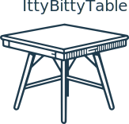

<p align="center">

</p>

<br> <!-- badges: start --> <!-- badges: end -->

## What?

`tinytable` is a small but powerful `R` package to draw HTML, LaTeX,
PDF, Markdown, and Typst tables. The user interface is minimalist, but
it gives users access to powerful frameworks to create endlessly
customizable tables.

<https://vincentarelbundock.github.io/tinytable>

## Why?

There are already many excellent table-drawing packages in the `R`
ecosystem. Why release a new one? As [the maintainer of
`modelsummary`](https://modelsummary.com), I needed a table-drawing
package which was:

-   *Simple*: Streamlined, consistent, and uncluttered user interface,
    with few functions to learn.
-   *Flexible*: Expressive frameworks to customize tables in HTML and
    LaTeX formats.[1]
-   *Zero-dependency*: Avoid importing any other `R` package.
-   *Concise*: Draw beautiful tables without typing a lot of code.
-   *Safe*: User inputs are checked thoroughly, and informative errors
    are returned early.
-   *Maintainable*: A small code base which does not rely on too many
    complex regular expressions.
-   *Readable*: HTML and LaTeX code should be human-readable and
    editable.
-   *Free*: This package will always be free. Tiny tables for a tiny
    price!

These are some of the tables that `tinytable` can draw:


To achieve these goals, the design philosophy of `tinytable` rests on
three pillars:

1.  *Data is separate from style.* The code that this package creates
    keeps the content of a table separate from the style sheet that
    applies to its cells. This is in contrast to other `R` packages that
    modify the actual text in each cell to style it. Keeping data and
    style separate allows `tidytable` to create human-readable files
    which are easy to edit, debug, and extend. It also enables
    developers to keep a tidy code base, with minimal use of messy
    regular expressions.

2.  *Flexibility.* Users’ needs are extremely varied, and a
    table-drawing package must be flexible enough to accomodate
    different ideas. To achieve this, `tinytable` builds on
    battle-tested and versatile frameworks like `Bootstrap` for HTML and
    `tabularray` for LaTeX.

3.  [*Lightweight is the right weight.*](https://www.tinyverse.org/)
    Some of the most popular table-drawing packages in the `R` ecosystem
    are very heavy: A single `library()` call can sometimes load upwards
    of 65 `R` packages. In contrast, `tinytable` imports zero 3rd party
    `R` package by default.

## Installation

You can install the development version of tinytable from
[GitHub](https://github.com/) with:

``` r
remotes::install_github("vincentarelbundock/tinytable")
```

## Get started

-   [Tutorial
    (HTML)](https://vincentarelbundock.github.io/tinytable/vignettes/tutorial.html)
-   [Tutorial
    (PDF)](https://vincentarelbundock.github.io/tinytable/vignettes/tutorial.pdf)

## Alternative packages

There are many fantastic table-drawing packages out there. If you don’t
like `tinytable`, I recommend you check out some of these:

-   [`kableExtra`](https://haozhu233.github.io/kableExtra/)
-   [`gt`](https://gt.rstudio.com)
-   [`DT`](https://rstudio.github.io/DT/)
-   [`flextable`](https://davidgohel.github.io/flextable/)
-   [`huxtable`](https://hughjonesd.github.io/huxtable/)

Did I miss your favorite package? Drop me a note and I’ll add it to the
list.

[1] Other formats like Markdown and Typst are also available, but less
flexible.
