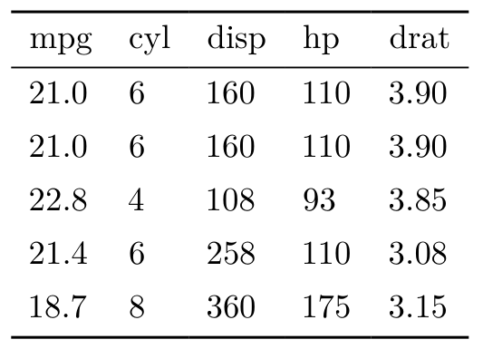

<p align="center">


<br> <!-- badges: start -->
<a href = "https://github.com/vincentarelbundock/tinytable/blob/main/LICENSE.md" target = "_blank"></a>
<a href = "https://vincentarelbundock.github.io/tinytable/" target = "_blank"></a>
<a href = "https://cran.r-project.org/package=tinytable" target = "_blank"></a>
<!-- badges: end -->
</p>

## What?

`tinytable` is a small but powerful `R` package to draw beautiful tables
in a variety of formats: HTML, LaTeX, Word[^1], PDF, PNG, Markdown, and
Typst. The user interface is minimalist and easy to learn, while giving
users access to powerful frameworks to create endlessly customizable
tables.

<https://vincentarelbundock.github.io/tinytable/>

## Why?

There are already many excellent table-drawing packages in the `R`
ecosystem. Why release a new one? As [the maintainer of
`modelsummary`](https://modelsummary.com), I needed a table-drawing
package which was:

- *Simple*: Streamlined, consistent, and uncluttered user interface,
  with few functions to learn.
- *Flexible*: Expressive frameworks to customize tables in HTML and
  LaTeX formats.[^2]
- *Zero-dependency*: Avoid importing any other `R` package.[^3]
- *Concise*: Draw beautiful tables without typing a lot of code.
- *Safe*: User inputs are checked thoroughly, and informative errors are
  returned early.
- *Maintainable*: A small code base which does not rely on too many
  complex regular expressions.
- *Readable*: HTML and LaTeX code should be human-readable and editable.
- *Free*: This package will always be free. Tiny tables for a tiny
  price!

To achieve these goals, the design philosophy of `tinytable` rests on
three pillars:

1)  *Data is separate from style.* The code that this package creates
    keeps the content of a table separate from the style sheet that
    applies to its cells. This is in contrast to other `R` packages that
    modify the actual text in each cell to style it. Keeping data and
    style separate allows `tinytable` to create human-readable files
    which are easy to edit, debug, and extend. It also enables
    developers to keep a simpler code base, with minimal use of messy
    regular expressions.

2)  *Flexibility.* Users’ needs are extremely varied, and a
    table-drawing package must be flexible enough to accomodate
    different ideas. To achieve this, `tinytable` builds on
    battle-tested and versatile frameworks like `Bootstrap` for HTML and
    `tabularray` for LaTeX.

3)  Lightweight. Some of the most popular table-drawing packages in the
    `R` ecosystem are very heavy: A single `library()` call can
    sometimes load upwards of 65 `R` packages. In contrast, `tinytable`
    imports zero 3rd party `R` package by default.

## Installation

`tinytable` is a relatively new package with rapid development. If you
want to benefit from the latest features—showcased on the package
website—you should install from R-Universe:

``` r
install.packages('tinytable', repos = c('https://vincentarelbundock.r-universe.dev', 'https://cloud.r-project.org'))
```

Alternatively, you can install it from CRAN:

``` r
install.packages("tinytable")
```

Restart `R` completely for the installation to take effect.

## First steps

The best feature of `tinytable` is its simplicity. To draw a table,
simply call the `tt()` function with your data frame as the first
argument:

``` r
library(tinytable)

x <- mtcars[1:5, 1:5]

tt(x)
```

<p align="center">


<br>

More complex tables can be created by calling arguments and chaining
functions together. In the next example, we add a caption, footnote,
colors, styles, and spanning column headers:

``` r
cap <- "A simple \\texttt{tinytable} example."
not <- "Nullam odio est, ullamcorper scelerisque lectus a, eleifend luctus nisl. Etiam ullamcorper, nibh vel interdum auctor, odio nulla mollis tortor, vel fringilla ante quam quis est."

tt(x, 
   caption = cap, 
   notes = not, 
   width = .5) |> 
 style_tt(
   i = 1:3,
   j = 1:2,
   background = "teal",
   color = "white",
   bold = TRUE) |>
 group_tt(
   j = list("Halloumi" = 1:2, "Tofu" = 4:5))
```

<p align="center">


<br>

## Tutorial

The `tinytable` 0.7.0.7 tutorial will take you much further. It is
available in two formats:

- [Tutorial
  (PDF)](https://vincentarelbundock.github.io/tinytable/vignettes/tinytable_tutorial.pdf)
- Tutorial (HTML):
  - [Tiny
    tables](https://vincentarelbundock.github.io/tinytable/vignettes/tinytable.html)
  - [Format](https://vincentarelbundock.github.io/tinytable/vignettes/format.html)
  - [Style](https://vincentarelbundock.github.io/tinytable/vignettes/style.html)
  - [Group
    labels](https://vincentarelbundock.github.io/tinytable/vignettes/group.html)
  - [Plots and
    images](https://vincentarelbundock.github.io/tinytable/vignettes/plot.html)
  - [Themes](https://vincentarelbundock.github.io/tinytable/vignettes/theme.html)
  - [Notebooks (Quarto, Rmarkdown, Bookdown,
    etc.)](https://vincentarelbundock.github.io/tinytable/vignettes/notebooks.html)
  - [Customization](https://vincentarelbundock.github.io/tinytable/vignettes/custom.html)
  - [FAQ](https://vincentarelbundock.github.io/tinytable/vignettes/faq.html)
  - [Alternatives](https://vincentarelbundock.github.io/tinytable/vignettes/alternatives.html)

[^1]: Styling options in Word are somewhat limited. See the FAQ page and
    the `style_tt()` documentation for details.

[^2]: Other formats like Markdown and Typst are also available, but less
    flexible.

[^3]: Some extra packages can be imported to access specific
    functionality, such as integration with Quarto, inserting `ggplot2`
    objects as inline plots, and saving tables to PNG images or PDF
    documents.
